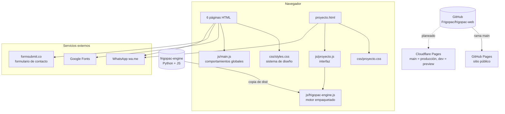
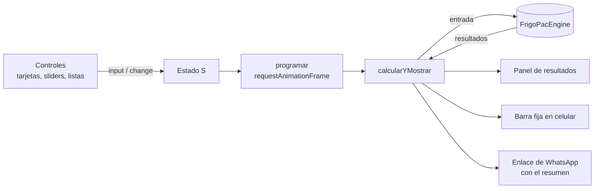
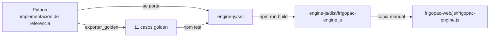

# Arquitectura del sitio FRIGOPAC

Estado al 7 de octubre de 2026 (rama `dev`). Este documento cumple el paso 1 del plan de la web del motor (`frigopac-engine/docs/PLAN_WEB.md`: "entender la web").

## 1. Vista general



No hay servidor propio, base de datos ni compilación. El navegador descarga los archivos tal como están en el repositorio.

## 2. Tecnología

| Capa | Qué se usa | Nota |
|---|---|---|
| Marcado | HTML5 | Una página por archivo, sin plantillas compartidas |
| Estilos | CSS con variables (`:root`) | Sin preprocesador ni framework |
| Comportamiento | JavaScript vanilla (ES2017+) | Sin dependencias |
| Tipografía | Google Fonts: Poppins (títulos y acentos), Inter (texto) | |
| Motor de cálculo | `FrigoPacEngine` v0.5.0, IIFE de ~100 KB | Generado con esbuild en `frigopac-engine` |
| Publicación | GitHub Pages desde `main` | Cloudflare Pages planeado (`docs/DESPLIEGUE_CLOUDFLARE.md`) |

## 3. Estructura de carpetas

```
frigopac-web/
├── index.html              Portada
├── nosotros.html           Empresa
├── servicios.html          Servicios, con carruseles de fotos
├── proyectos.html          Galería de proyectos
├── contacto.html           Formulario de contacto
├── proyecto.html           Project Engine: "Diseñe su cuarto frío"
├── css/
│   ├── styles.css          Sistema de diseño y estilos globales
│   └── proyecto.css        Estilos de la calculadora (prefijo pe-)
├── js/
│   ├── main.js             Comportamientos globales
│   ├── proyecto.js         Interfaz de la calculadora
│   └── frigopac-engine.js  Motor de cálculo (GENERADO, no editar)
├── assets/
│   ├── images/             Fotos, logos de clientes y fondos
│   └── videos/             Video de fondo del hero
├── docs/                   Documentación interna (no es parte del sitio)
├── AGENTS.md               Reglas para agentes y colaboradores
└── CLAUDE.md               Contexto general para Claude
```

## 4. Páginas

| Página | Propósito | Navegación | Estilos | Scripts |
|---|---|---|---|---|
| `index.html` | Portada: hero con video, cinta de clientes, proceso en 4 pasos, servicios, sectores, proyectos destacados y llamado final | `.site-header` | `styles.css` | `main.js` |
| `nosotros.html` | Historia y equipo | `.site-header` | `styles.css` + bloque `<style>` propio | `main.js` |
| `servicios.html` | Servicios con carruseles de fotos | `.site-header` | `styles.css` + bloque `<style>` propio | `main.js` (carrusel) |
| `proyectos.html` | Galería de proyectos | `.site-header` | `styles.css` + bloque `<style>` propio | `main.js` |
| `contacto.html` | Formulario de contacto | `.site-header` | `styles.css` + bloque `<style>` propio | `main.js` |
| `proyecto.html` | Calculadora de cuartos fríos | `.site-header` | `styles.css` + `proyecto.css` | `main.js`, `frigopac-engine.js`, `proyecto.js` |

### Piezas compartidas

La cabecera (`.site-header`), el pie de página (`.footer`) y el botón de WhatsApp (`.whatsapp-float`) son **idénticos en las seis páginas**. Lo único que cambia es qué enlace lleva `aria-current="page"`. Como no hay plantillas, están copiados en cada archivo: si se cambia uno, se cambian los seis, tomando `index.html` como referencia.

| Pieza | Dónde está | Excepción |
|---|---|---|
| Cabecera | Las 6 páginas | La página actual marca su enlace |
| Pie de página | Las 6 páginas | — |
| Botón de WhatsApp | 5 páginas | No va en `proyecto.html`, que tiene su propia barra inferior en celular |
| Enlace de fuentes | Las 6 páginas | Solo Poppins e Inter |

## 5. Estilos

### 5.1 Sistema de diseño (`:root` en `css/styles.css`)

| Grupo | Variables | Valores principales |
|---|---|---|
| Color | `--color-primary`, `-primary-light`, `-secondary`, `-accent`, `-white`, `-gray-100…800`, `-dark` | Azul marino `#0B1D3A`, cian `#00B4D8`, dorado `#C9A227` |
| Tipografía | `--font-heading`, `--font-accent`, `--font-body` | Poppins, Poppins, Inter |
| Tamaños de texto | `--text-xs` … `--text-7xl` | 0,75 rem a 4,5 rem |
| Espaciado | `--space-xs` … `--space-4xl` | 0,5 rem a 8 rem |
| Transiciones | `--transition-fast`, `-base`, `-slow`, `-slower` | 0,2 s a 0,8 s |
| Sombras | `--shadow-sm` … `--shadow-xl` | |
| Radios | `--radius-sm`, `-md`, `-lg`, `-full` | 4 px a 9999 px |
| Otros | `--header-height` | 80 px |

### 5.2 Mapa de `css/styles.css`

| § | Sección | Usada en |
|---|---|---|
| 1 | Variables | Todo el sitio |
| 2 | Reset y base | Todo el sitio |
| 3 | Utilidades y animación de aparición (`.reveal`) | Portada |
| 4 | Botones (`.btn`) | Todo el sitio |
| 5 | Cabecera del sitio (`.site-header`): barra de cristal fija, menú en línea desde 960 px, panel desplegable en celular | Todas |
| 5b | Encabezado de las páginas internas (`.page-hero`; `.page-hero--compact` en contacto) | Nosotros, servicios, proyectos, contacto |
| 6 | Hero de la portada (`.hero`, `.hero-btn`) | Portada |
| 7 | Proceso en 4 pasos (`.trust-bar`) | Portada |
| 8 | Servicios (`.capabilities`) | Portada |
| 9 | Sectores (`.industries`) | Portada |
| 10 | Proyectos destacados (`.projects`) y cinta de clientes (`.clients`, `.marquee`) | Portada |
| 11 | Testimonios (`.testimonial`) | Ninguna página |
| 12 | Llamado final (`.cta`) | Portada |
| 13 | Pie de página (`.footer`) | Todo el sitio |
| 14 | Botón flotante de WhatsApp | Todo menos contacto y calculadora |
| 17 | Animaciones de páginas internas y botón hacia la calculadora | Varias |

Las páginas internas conservan un bloque `<style>` con estilos propios de su contenido.

### 5.3 Estilos de la calculadora (`css/proyecto.css`)

Todas las clases llevan el prefijo `pe-` para no chocar con el resto del sitio. Usa las variables de `:root` (135 referencias), así que hereda colores, tipografías y espacios. Tiene seis colores fijos para los estados de las alertas (éxito, advertencia, error).

## 6. JavaScript global (`js/main.js`)

Un solo `DOMContentLoaded` con bloques independientes:

| § | Bloque | Elementos que busca | Se usa en |
|---|---|---|---|
| 1 | Sombra de la cabecera al bajar | `#siteHeader` | Todas |
| 2 | Menú en celular: abre y cierra, se cierra con Escape y al pasar a escritorio | `#siteMenuToggle`, `#siteMenu` | Todas |
| 3 | Contador de cifras | `#stats`, `.stats__number` | Ninguna página |
| 4 | Scroll suave en enlaces `#` | `a[href^="#"]` | Todo el sitio |
| 5 | Parallax del hero | `.hero__background img/video` | Portada |
| 7 | Carruseles | `.carousel` | Servicios |
| 8 | Aparición al hacer scroll | `.reveal` | Portada |
| 9 | Reanudar el video del hero si el navegador lo pausa | `.hero__bg-video` | Portada |

## 7. La calculadora (Project Engine)

### 7.1 Cómo funciona en la página



- `proyecto.js` no contiene física: arma la entrada con lo que eligió el cliente, llama al motor y pinta.
- Cada cambio se agrupa en un cuadro de animación (`requestAnimationFrame`), así el cálculo no se repite mientras se arrastra un slider.
- Funciones del motor que usa: `calcular`, `capacidadDe`, `revisarInventario`, `calcularEnergia`, `oportunidadesAhorro`, `dimensionar` y los catálogos de `datos` (productos, ciudades, kilos por canastilla).
- El botón final abre WhatsApp con el resumen del proyecto. No se guarda nada en ningún servidor.
- Hoy existe la fase 1 ("Explorar"). Las fases 2 a 4 (afinar, diagnóstico, cotizar con ID de proyecto) están en el plan pero no construidas.

### 7.2 De dónde sale el motor



La física se cambia primero en Python, se valida con sus pruebas, se porta a JavaScript y el puerto debe reproducir los casos golden. La web solo recibe el archivo final.

### 7.3 Actualizar el motor en la web

1. En `frigopac-engine/engine-js`: `npm test` debe pasar y `npm run build` genera `dist/frigopac-engine.js`.
2. Copiar ese archivo a `frigopac-web/js/frigopac-engine.js` sin modificarlo.
3. Abrir `proyecto.html` en local y comprobar en la consola: `FrigoPacEngine.VERSION`.
4. Registrar en `docs/BITACORA.md` la versión anterior y la nueva.

Hoy la copia es idéntica a la versión 0.5.0 del motor; solo cambia el salto de línea final (Windows convierte `LF` en `CRLF`).

## 8. Imágenes y video

- `assets/images/`: fotos de proyectos, logos de clientes (cinta de la portada) y fondos.
- `assets/videos/hero-bg.mp4`: video de fondo de la portada (2,2 MB, 1344 × 768, 5 s, sin sonido). La imagen `hero-bg.jpg` sirve de póster mientras carga.
- Varias imágenes superan el tamaño recomendado y algunas referencias apuntan a archivos que no existen. El detalle está en la auditoría.

## 9. Publicación

| Entorno | Rama | Dirección | Estado |
|---|---|---|---|
| Producción | `main` | https://frigopac.github.io/frigopac-web/ | Activo (GitHub Pages) |
| Preview | `dev` | `dev.<proyecto>.pages.dev` | Pendiente de conectar Cloudflare |
| Local | cualquiera | http://localhost:8000 | `python -m http.server 8000` |

El repositorio es público. GitHub Pages gratuito lo exige; Cloudflare Pages no, así que al migrar se puede volver privado.

## 10. Servicios externos

| Servicio | Para qué | Dónde |
|---|---|---|
| Google Fonts | Poppins e Inter | `<head>` de cada página |
| formsubmit.co | Envía el formulario de contacto al correo de gerencia | `contacto.html` |
| WhatsApp (`wa.me`) | Botón flotante y cierre de la calculadora | Pie de página, botón flotante, `proyecto.js` |
| Instagram | Enlace en el pie de página | Todas las páginas |

## 11. Decisiones de arquitectura

| Decisión | Por qué | Costo que se acepta |
|---|---|---|
| Sitio estático sin compilación | Hosting gratis, cualquier persona puede editarlo, nada que se rompa al compilar | Cabecera y pie copiados en cada página |
| Motor de cálculo en el navegador | Resultados al instante con cada slider; la física y los datos son públicos | ~100 KB extra solo en `proyecto.html` |
| Precios solo en un servidor futuro | No exponer la estructura de costos de FRIGOPAC | El Motor 4 (inversión) espera a tener servidor |
| La IA no calcula | Los números deben ser reproducibles y auditables | — |

## 12. Hacia dónde va

- **Servidor mínimo**: Cloudflare Pages Functions (en la misma cuenta que el hosting) puede recibir los leads con ID de proyecto, guardar el consentimiento de datos (Ley 1581 de 2012) y, más adelante, calcular la inversión con precios que nunca llegan al navegador.
- **Componentes compartidos**: si el sitio pasa de unas diez páginas (por ejemplo, con un catálogo de proyectos), conviene un generador estático que comparta cabecera y pie. Hasta entonces, se mantiene sin compilación.
