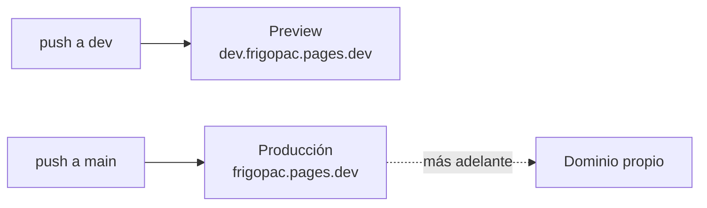

# Despliegue en Cloudflare Pages

Guía paso a paso para publicar el sitio en Cloudflare Pages, con `main` como producción y `dev` como vista previa. No hace falta comprar dominio para empezar.

> Los menús de Cloudflare cambian con frecuencia. Si un botón no aparece con el nombre exacto, busque la opción equivalente; la configuración que importa está en el paso 4.

## Antes de empezar

- [ ] Acceso de **propietario** a la organización `Frigopac` en GitHub (para autorizar la conexión).
- [ ] Un correo para la cuenta de Cloudflare.
- [ ] 15 minutos.

## Cómo queda

Cada push se publica solo, en uno o dos minutos.

## Paso 1 · Crear la cuenta

Entrar a https://dash.cloudflare.com/sign-up y crear una cuenta gratuita. No pide tarjeta.

## Paso 2 · Crear el proyecto

1. En el menú izquierdo: **Workers & Pages**.
2. **Create** (crear) y elegir la pestaña **Pages**.
3. **Connect to Git** (conectar con Git).

## Paso 3 · Conectar GitHub

1. Elegir **GitHub** y autorizar la aplicación de Cloudflare.
2. Instalarla en la organización **Frigopac**.
3. En acceso a repositorios, marcar **Only select repositories** y elegir solo `frigopac-web`.
4. Volver a Cloudflare y seleccionar `frigopac-web`.

## Paso 4 · Configurar la publicación

| Campo | Valor |
|---|---|
| Project name | `frigopac` (define la dirección `frigopac.pages.dev`; si está tomado, Cloudflare propone otro) |
| Production branch | `main` |
| Framework preset | `None` |
| Build command | `mkdir -p _site && cp -r *.html css js assets _site/` |
| Build output directory | `_site` |
| Root directory | vacío |
| Environment variables | ninguna |

**Por qué ese comando**: copia solo lo que forma parte del sitio (las páginas, `css`, `js` y `assets`) a una carpeta `_site` y publica esa carpeta. Así `docs/`, `AGENTS.md` y `CLAUDE.md` no quedan visibles en la página.

Si algún día se agrega una carpeta nueva al sitio (por ejemplo `fonts/`), hay que sumarla al comando.

**Alternativa más simple**: build command vacío y build output directory `/`. Funciona igual, pero publica también la documentación interna.

## Paso 5 · Publicar

1. **Save and Deploy**.
2. Esperar a que termine (uno o dos minutos).
3. Abrir la dirección que muestra, tipo `https://frigopac.pages.dev`.

## Paso 6 · Activar el preview de `dev`

1. Dentro del proyecto: **Settings** → **Builds & deployments** (o **Build**).
2. En **Branch control** (control de ramas):
   - Production branch: `main`.
   - Preview branches: **Custom branches**, e incluir `dev`.
3. Guardar.
4. Hacer cualquier push a `dev` (o **Retry deployment** sobre el último de `dev`).

Desde ahí, `dev` se ve en `https://dev.frigopac.pages.dev`. Además, cada despliegue tiene su propia dirección fija (`https://<código>.frigopac.pages.dev`) por si hay que comparar versiones.

### Opcional · Que solo usted vea el preview

Por defecto, el preview es público para quien tenga el enlace. Para restringirlo:

1. **Settings** → **General** → **Enable access policy** (política de acceso para previews).
2. Agregar los correos autorizados. Cloudflare Access es gratis hasta 50 usuarios.

## Paso 7 · Verificar

- [ ] Las seis páginas abren: `/`, `/nosotros.html`, `/servicios.html`, `/proyectos.html`, `/contacto.html`, `/proyecto.html`.
- [ ] El video del hero corre.
- [ ] La calculadora responde al mover los sliders.
- [ ] `/docs/ARQUITECTURA.md` da error 404 (la documentación no se publica).
- [ ] El preview de `dev` abre.

## Paso 8 · Dominio propio (cuando se compre)

**Si se compra en Cloudflare** (`.com` u otros que Cloudflare vende a precio de costo):
1. En el proyecto: **Custom domains** → **Set up a custom domain**.
2. Escribir el dominio (por ejemplo `frigopac.com` y luego `www.frigopac.com`).
3. Cloudflare crea los registros DNS y el certificado SSL solo.

**Si se compra en otro registrador** (por ejemplo un `.com.co`, que Cloudflare no vende):
1. En Cloudflare: **Add a site** con el dominio, plan **Free**.
2. Cloudflare muestra dos *nameservers*; ponerlos en el panel del registrador donde se compró.
3. Esperar a que Cloudflare confirme el cambio (de minutos a 24 horas).
4. Seguir los pasos de "Si se compra en Cloudflare".

Después de conectar el dominio, actualizar en el código `og:url` y agregar `rel="canonical"` con la dirección definitiva.

## Paso 9 · Cerrar GitHub Pages y volver privado el repositorio

En este orden, y solo cuando Cloudflare ya funcione:

1. **Apagar GitHub Pages**: en GitHub, `frigopac-web` → **Settings** → **Pages** → Source: **None**. Así Google no ve dos copias del mismo sitio.
2. **Volver privado el repositorio**: **Settings** → **General** → **Danger Zone** → **Change visibility** → **Private**.
3. Comprobar que Cloudflare sigue publicando: hacer un push a `dev` y ver que aparezca el despliegue.

Si se hace al revés, el sitio de GitHub Pages deja de funcionar antes de tener el reemplazo.

## Uso diario

| Quiero… | Hago… |
|---|---|
| Ver un cambio antes de publicarlo | Push a `dev` y abrir `dev.frigopac.pages.dev` |
| Publicarlo | Con aprobación: fusionar `dev` en `main` y push |
| Volver a la versión anterior | **Deployments** → elegir el despliegue bueno → **Rollback to this deployment** |
| Ver por qué falló | **Deployments** → el despliegue fallido → **View build log** |

## Problemas frecuentes

| Síntoma | Causa probable | Solución |
|---|---|---|
| El build falla con `cp: cannot stat` | Se renombró o borró una carpeta del comando | Ajustar el build command |
| Una imagen funciona en local pero no publicada | Mayúsculas: el servidor distingue `Logo.png` de `logo.png` y Windows no | Usar nombres en minúsculas |
| Se ve la versión anterior | Caché del navegador | `Ctrl + Shift + R` |
| `dev` no genera preview | `dev` no está en las ramas de preview | Revisar el paso 6 |

## Plan gratuito

Límites aproximados (verificar en https://developers.cloudflare.com/pages/platform/limits/):

| Concepto | Límite gratis | Este sitio |
|---|---|---|
| Ancho de banda y visitas | Sin límite | — |
| Despliegues | 500 al mes | Uno por push |
| Archivos por sitio | 20 000 | 36 |
| Tamaño por archivo | 25 MB | El mayor pesa 5,4 MB |
| Dominios propios | 100 por proyecto | 1 o 2 |

Costo: $0. Solo se paga el dominio, cuando se compre.

## Más adelante

Cloudflare Pages Functions, en la misma cuenta y con plan gratuito, sirve para la parte de servidor que prevé el plan del motor: recibir los leads con número de proyecto, guardar el consentimiento de datos y calcular la inversión sin enviar precios al navegador.
